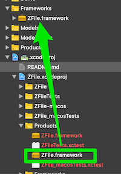

# Frameworks to help Automate build scripts written in Swift

... Currently exploring how to use this. Very experimental state.

## GOAL of highway

This changed from the original project

1. Build frameworks you can use to write a script in swift that runs Terminal commands
2. Building with xcbuild from swift code
3. Optimize git workflow from Swift
4. Generate reliable code using sourcery with a swift command

# Usage

First resolve some dependencies from the xcode project

```bash
carthage update --no-build --use-submodules`
xcodebuild -project Sources/highway/Automate🛣.xcodeproj -scheme AutomateHighway

```

## Run from Terminal

 ``` bash
 cd Sources/highway
 <#path to automate app, probably derivedData#>/Automate.app/Contents/MacOS/Automate 🤖command:sourcery
 ```

## Integrate in your project

Use [Carthage](https://www.github.com/Carthage/Carthage)

1. Add Cartfile with > `github "doozMen/highway" "master"` // ⚠️ change master to a tag to fix on a version
2. `carthage update --no-build --use-submodules`
3. Embed the  `🛣.xcodeproj` file in your project like ZFile.xcodeProj is embeded in `🛣.xcodeproj
4. Set the **framework search path** to `$(BUILD_DIR)/$(CONFIGURATION)$(EFFECTIVE_PLATFORM_NAME)` in the **GENERAL** project settings,

    > ⚠️ so not in the target. In the target(s) use `$inherited`
5. Add **macos** `Automate` target
6. Embed all frameworks from  Highway except the iOS versions
7. Open the hihway project and drag the ZFile.framework to the frameworks folder in your project

    

    > 💁🏻‍♂️ By doing an embed of the project folder the dependencies and builds are signed correctly while distributing or debugging

The goal is not to provide an out of the box script. You use the different frameworks to automate your workflow.

Below is an example use case of how the Automate.app is made for the highway project.

# Example use cases

Run sourcery to generate protocols.

1. Add an Macos application to your project named `Automate`
    > The project Highway contains a Automate target setup like we explan in this use case

2.  I can not work, to my knowledge, in a sandboxed way. So you need to do 2 things:
    2.1 Automate has a .entitlements file. Set sandbox to no
    ```xml
    <?xml version="1.0" encoding="UTF-8"?>
    <!DOCTYPE plist PUBLIC "-//Apple//DTD PLIST 1.0//EN" "http://www.apple.com/DTDs/PropertyList-1.0.dtd">
    <plist version="1.0">
    <false/>
    </plist>
    ```
    2.3 In build settings set inject base entitlements to no. `CODE_SIGN_INJECT_BASE_ENTITLEMENTS=NO`
4. Info.plist should contain `BE_DOOZ_SRCROOT = $SRCROOT)`

3. Add button to run sourcery in storyboard (see `AutomateHighwayViewControlle`r)
	
4. Set sourcery paths to your liking. Use output in console to guide you if you used the example code above.

5. Try running automate from command line

	5.1 Before this can work all dependencies should be embedded in the application. Go to Automate target and verify that the following list is embedded
	*List of frameworks to embed*
	```
	/* Begin PBXCopyFilesBuildPhase section */
			FDEC120121C6869C00CB7DAD /* Embed Frameworks */ = {
				isa = PBXCopyFilesBuildPhase;
				buildActionMask = 2147483647;
				dstPath = "";
				dstSubfolderSpec = 10;
				files = (
					FDEC121121C687E600CB7DAD /* Errors.framework in Embed Frameworks */,
					FD11267C21C689AF0072607D /* Deliver.framework in Embed Frameworks */,
					FDEC120521C686B700CB7DAD /* SourceryWorker.framework in Embed Frameworks */,
					FDEC121D21C688EE00CB7DAD /* Url.framework in Embed Frameworks */,
					FDEC120721C686E200CB7DAD /* SourceryAutoProtocols.framework in Embed Frameworks */,
					FDEC121921C688D600CB7DAD /* Result.framework in Embed Frameworks */,
					FDEC120921C6871900CB7DAD /* Terminal.framework in Embed Frameworks */,
					FD11267821C689AF0072607D /* Keychain.framework in Embed Frameworks */,
					FDEC120321C686AF00CB7DAD /* Arguments.framework in Embed Frameworks */,
					FDEC122121C688F900CB7DAD /* XCBuild.framework in Embed Frameworks */,
					FDEC122521C6890500CB7DAD /* Git.framework in Embed Frameworks */,
					FD1126E221C77F060072607D /* SignPost.framework in Embed Frameworks */,
					FDEC121521C688B600CB7DAD /* POSIX.framework in Embed Frameworks */,
					FDEC120F21C6876B00CB7DAD /* Task.framework in Embed Frameworks */,
				);
				name = "Embed Frameworks";
				runOnlyForDeploymentPostprocessing = 0;
			};
	/* End PBXCopyFilesBuildPhase section */
	```
	5.2 Run from command Line

	```bash
	cd <Project root>
	<#path to automate app, probably derivedData#>/Automate.app/Contents/MacOS/Automate 🤖command:sourcery
	```
> This should output sourcery success and quit the app.
