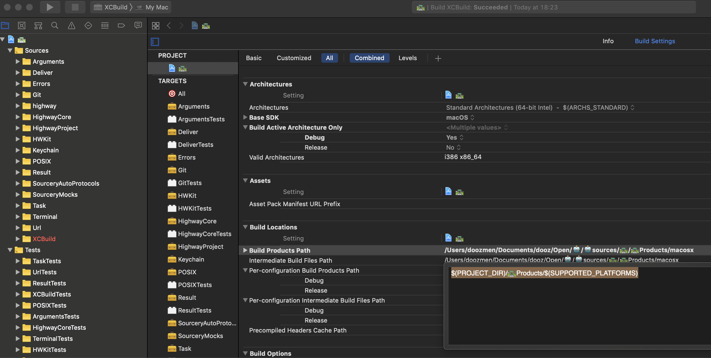

# Usage

First resolve some dependencies from the xcode project

1. `carthage update --no-build --use-submodules`
2. `carthage build`
3. `open 🛣.xcodeproj`

## Integrate in your project

Use [Carthage](https://www.github.com/Carthage/Carthage)

1. Add Cartfile with
> `github "doozMen/highway" "master"` // ⚠️ change master to a tag to fix on a version
2. `carthage update --no-build --use-submodules`
3. Build the frameworks via xcode or `carthage build``
4. Set the **framework search path** to where you build the frameworks
(optional) 5. If you build an app make sure to embed the framework.

**Want to do it easiar?**
1. `cd 🛣Products`
2. You will find Debug and Release builds of the frameworks. Copy them and add dependencies to your project

> 💁🏻‍♂️ You can use the variables of xcode to make it easiar to use the correct framework for release or Debug. See tip below!

---

## What can you do?

1. Run terminal commands from Swift
2. Use XCBuild in Swift

... Currently exploring how to use this. Very experimental state.

---

⚠️

## Dependency TYP

* Use a known build output directory
* Set the framework search path dependend on the platform and configuration that is being build

**Known build output**

With XCode I always struggle with the dependencies. So I made an explanation that helps me understand. I hope it helps you.

In this screenshot you can see 2 important things that are not apparent at first.

1. Upper left select the overall project settings
1.1 ⚠️ Targets below inherit the settings from the above so you do not have to do the same thing for all targets. Just add ` $(inherited)`
2. The build output can be set in settings. To make it different for different configurations and platforms use xcode globals that expand to the correct folder when you wrap them in `$(<xcode global>)`
2.1 In this case it is wanted that the build output of any target goes into the project folder. `$(PROJECT_DIR)/🛣Products/$(SUPPORTED_PLATFORMS)` expand when building to the 🛣Products directory you can find in this repo.

**Framework Search Path**

3. Just add `$(PROJECT_DIR)/🛣Products/$(SUPPORTED_PLATFORMS)/$(CONFIGURATION)` to the global framework search path and `$(inherited)` to all the targets.
